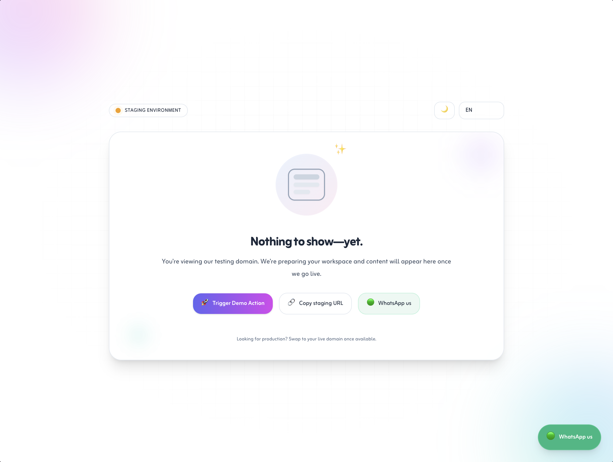
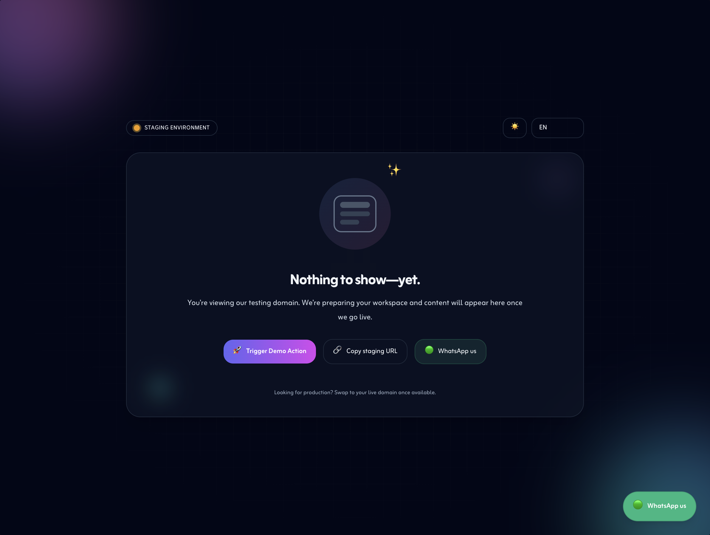

# Staging Empty State Page

A responsive, bilingual (English & Arabic) empty state page for staging domains, built with **Tailwind CSS** and **Alpine.js**.

## Features
- **Bilingual Support**: English and Arabic, with automatic RTL/LTR layout switching.
- **Theme Toggle**: Light/Dark mode switch.
- **Persistent Preferences**: User language and theme preferences saved in local storage.
- **WhatsApp CTA**: Quick contact link with customizable phone number.
- **Responsive Design**: Optimized for mobile, tablet, laptop, desktop, and TV.
- **Animations**: Floating gradients, twinkling accents, and emoji confetti effect.

## Usage
1. **Clone the repository:**
```bash
git clone https://github.com/mbs047/staging-empty-state.git
```

2. **Open the page:**
   - Launch `index.html` in your browser, or
   - Integrate it into your Laravel/Livewire or any other web project.

3. **Customize:**
   - **WhatsApp number**: Edit `whatsappNumber` in the `app()` function.
   - **Branding and colors**: Adjust Tailwind classes and gradients.
   - **Default language**: Change the default in the `lang` variable inside `app()`.

## File Structure
```
index.html      # Main HTML file
/images/        # Screenshots and preview images
```

## Demo
### Light Mode


### Light Mode — Arabic


### Dark Mode


### Dark Mode — Arabic


## Author
**Mohammed Baobaid**
- GitHub: [@mbs047](https://github.com/mbs047)
- Email: m.baobaid@outlook.com

## License
This project is licensed under the MIT License — see the [LICENSE](LICENSE) file for details.
